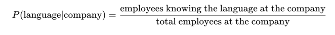

# Employee Programming Language Probability Calculator

This project calculates the **conditional probability** of a programming language given a company:



This exercise is based on the problem statement from **[HackMD](https://hackmd.io/@gtarawneh/HkzQJm-9kl)**.

## 📂 Project Structure
```
Linkedin/
│── src/
│   ├── json/
│   │   ├── data.json          # Input dataset (employee data)
│   ├── utils/
│   │   ├── employees_knowing_language_per_company.py  # Counts employees knowing each language per company
│   │   ├── filter.py           # Filters employees who worked at 3+ companies
│   │   ├── identification.py   # Identify companies and languages
│   │   ├── load_data.py        # Loads JSON data
│   │   ├── probability.py      # Calculates P(language | company)
│   │   ├── save_data.py        # Saves computed data
│   │   ├── total_employees_per_company.py  # Counts total employees per company
│   ├── main.py                 # Main execution file
```

## 🔧 How It Works
1. **Filter Employees** – Keep only employees who worked at 3+ companies.
2. **Count Employees Per Company** – Get the total number of employees for each company.
3. **Count Employees Per Language** – Count how many employees at each company know each programming language.
4. **Calculate Probability** – Compute **P(language | company)** using the formula above.

## 🚀 How to Run
1. Install Python (if not installed).
2. Clone the repository:
   ```sh
   git clone https://github.com/MuathOthman/EmployeeProgrammingLanguageProbabilityCalculator.git
   cd EmployeeProgrammingLanguageProbabilityCalculator/src/
   ```
3. Run the program:
   ```sh
   python main.py
   ```
4. The calculated probabilities will be saved in **probabilities.json** and displayed.

## 📊 Example Output
```
P(Go | Meta) = 0.56
P(Rust | Netflix) = 0.62
P(Python | Facebook) = 0.50
```

Created by **Muath Othman**  

